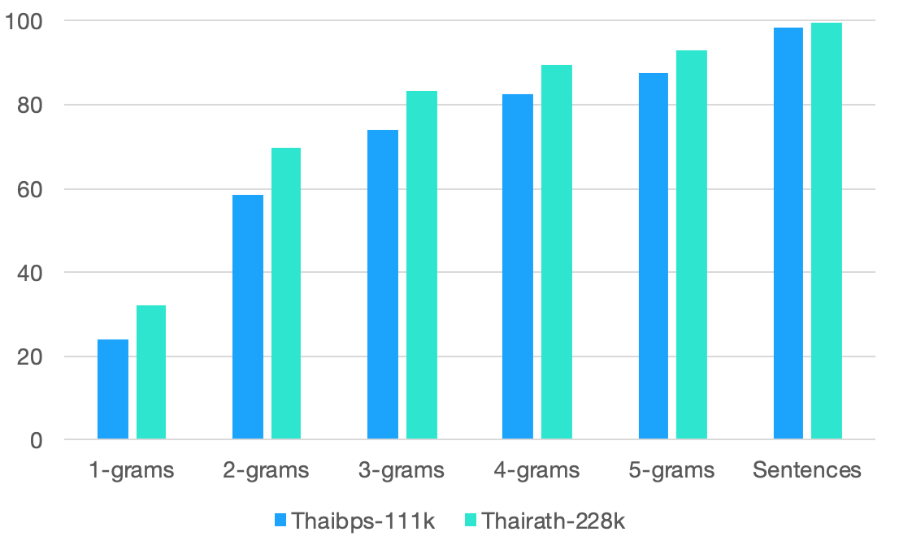

# thaipbs-111k
**A dataset for Thai Text Summarisation from https://news.thaipbs.or.th/news.**

The `thaipbs-111k` dataset is crawled from the news site Thai PBS News. This dataset is purposefully scraped for evaluating various Thai NLP tasks especially text summarization and news article text classification. We filtered out those articles which match, at least, one of following conditions:

- Article body contains less than 50 words.
- Summary contains less than 8 words.
- The abstractedness of the summary at 1-grams is *higher* than 65%.

After filtering, it contains 111,614 articles with xxx,xxx tags and x,xxx lebels from May 8, 2015 to October 21, 2019. This dataset was crawled and cleaned by [@CaramelWaffle](https://github.com/caramelWaffle) and [@nakhunchumpolsathien](https://github.com/nakhunchumpolsathien). 

## `thaipbs-111k` Dataset Statistics
| Properties     | Value |
| :--------- | -----:|
| Dataset Size  | 111,614 |
| Average Article Length     |   254.28 |
| Average Summary Length     |    36.52 |
| Average Title Length |      —|
| Unique Tag Size |  — |
| Vocabulary Size | — |
> — To be updated
### Level of Abstractedness
Abstractedness of the dataset is measured by calculating the unique n-grams in the reference summary which are not in the article. We compare the abstractedness level of `thaipbs-111k` dataset to `thairath-228k` dataset. The comparison is shown in the below figure.

## License
 This dataset is licensed under a <a rel="license" href="http://creativecommons.org/licenses/by/4.0/">Creative Commons Attribution 4.0 International License</a>. Based on a work at <a xmlns:dct="http://purl.org/dc/terms/" href="https://github.com/caramelWaffle/thaipbs-111k" rel="dct:source">https://github.com/caramelWaffle/thaipbs-111k</a>.
